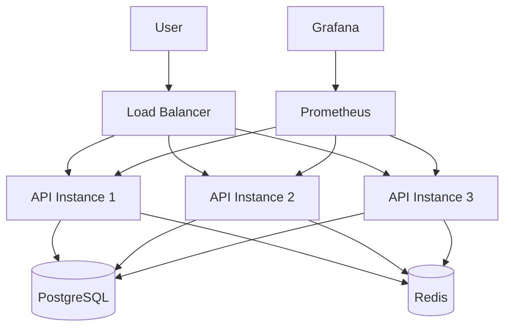
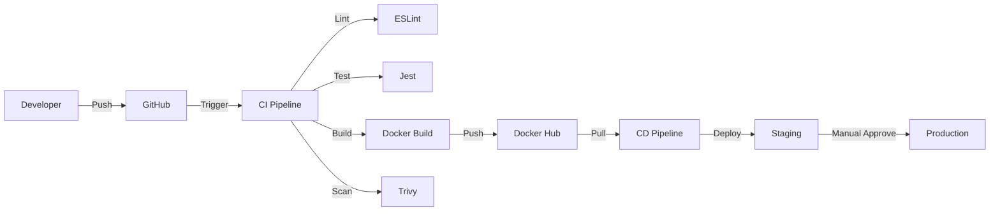
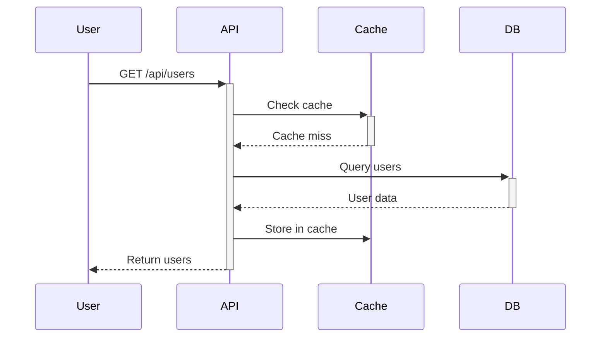
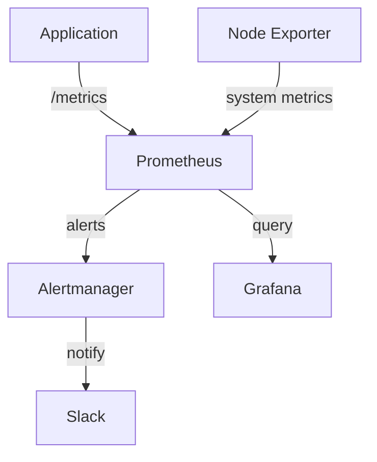

# Review & Documentation - Runbooks, Diagrams, Handoff

# Documentation best practices for DevOps projects
# Runbooks, architecture diagrams, post-mortems, handoff docs

# ━━━━━━━━━━━━━━━━━━━━━━━━━━━━━━━━━━━━━━━━━━━
# RUNBOOK CREATION
# ━━━━━━━━━━━━━━━━━━━━━━━━━━━━━━━━━━━━━━━━━━━

# Runbook template
cat << 'EOF' > RUNBOOK.md
# Production Runbook

## Quick Reference
- **Service**: API Service
- **URL**: https://example.com
- **On-call**: #oncall Slack channel
- **Monitoring**: https://grafana.example.com

## Emergency Contacts
- Backend Lead: @john (Slack)
- DevOps: @sarah (Slack)
- PagerDuty: +1-555-0100

---

## Common Operations

### Deploy New Version
```bash
# 1. Merge PR to main
# 2. Wait for CI to pass
# 3. Approve deployment in GitHub Actions
# 4. Monitor: https://grafana.example.com/d/api-dashboard
```

### Rollback Deployment
```bash
ssh production-server
cd /opt/app
git log --oneline -5                    # find previous commit
export IMAGE_TAG=abc123                 # previous working commit
docker-compose up -d --no-deps api
curl http://localhost:3000/health       # verify
```

### Restart Service
```bash
ssh production-server
docker-compose restart api
docker-compose ps                       # verify running
```

### Scale Service
```bash
ssh production-server
docker-compose up -d --scale api=3      # scale to 3 instances
```

---

## Troubleshooting

### Service Down
**Symptoms**: Health check fails, 500 errors

**Investigation**:
1. Check container status: `docker-compose ps`
2. Check logs: `docker-compose logs api --tail=100`
3. Check resources: `docker stats`

**Common causes**:
- Out of memory → Restart container
- Database connection failed → Check DB status
- Port conflict → Check `docker-compose ps`

**Resolution**:
```bash
# Quick fix: Restart
docker-compose restart api

# If restart fails: Re-deploy
docker-compose down api
docker-compose up -d api
```

### High Error Rate
**Symptoms**: Error rate > 5% in Grafana

**Investigation**:
1. Check error logs: `docker-compose logs api | grep ERROR`
2. Check which endpoint: Grafana → Errors by endpoint
3. Check recent changes: `git log --oneline -5`

**Common causes**:
- Bad deployment → Rollback
- External API timeout → Check API status
- Database slow → Check DB metrics

### High Latency
**Symptoms**: p95 latency > 1s

**Investigation**:
1. Check CPU/memory: `docker stats`
2. Check database: Connection pool full?
3. Check external APIs: Are they slow?

**Resolution**:
- Scale up: `docker-compose up -d --scale api=3`
- Optimize queries
- Add caching

---

## Deployment Checklist
- [ ] CI passed (all tests green)
- [ ] Code reviewed and approved
- [ ] Database migrations applied
- [ ] Environment variables updated
- [ ] Monitoring dashboards ready
- [ ] Rollback plan prepared
- [ ] Team notified in #deployments

## Monitoring Links
- Grafana: https://grafana.example.com
- Prometheus: https://prometheus.example.com
- Alertmanager: https://alertmanager.example.com
- Logs: `ssh production-server "docker-compose logs -f api"`
EOF

# ━━━━━━━━━━━━━━━━━━━━━━━━━━━━━━━━━━━━━━━━━━━
# ARCHITECTURE DIAGRAMS (Mermaid)
# ━━━━━━━━━━━━━━━━━━━━━━━━━━━━━━━━━━━━━━━━━━━

# System architecture diagram
cat << 'EOF' > ARCHITECTURE.md
# System Architecture

## High-Level Architecture



## CI/CD Pipeline



## Data Flow



## Monitoring Architecture


EOF

# Render Mermaid diagrams (using mermaid-cli)
npm install -g @mermaid-js/mermaid-cli
mmdc -i ARCHITECTURE.md -o architecture-diagrams.pdf

# Alternative: Use online tools
# - https://mermaid.live/
# - https://app.diagrams.net/

# ━━━━━━━━━━━━━━━━━━━━━━━━━━━━━━━━━━━━━━━━━━━
# POST-MORTEM TEMPLATE
# ━━━━━━━━━━━━━━━━━━━━━━━━━━━━━━━━━━━━━━━━━━━

cat << 'EOF' > POST_MORTEM_TEMPLATE.md
# Post-Mortem: [Incident Title]

**Date**: 2025-05-09
**Duration**: 45 minutes
**Severity**: High (Service degraded)
**Impact**: 10,000 users affected, $5,000 revenue loss

---

## Summary
Brief summary of what happened (2-3 sentences).

Example:
API service experienced high latency (p99 > 5s) from 14:00-14:45 due to database connection pool exhaustion. 10,000 users experienced slow checkout. Issue resolved by increasing connection pool size.

---

## Timeline (UTC)
| Time  | Event |
|-------|-------|
| 14:00 | Alert: High latency detected (p99: 3s) |
| 14:05 | On-call investigates, sees CPU normal |
| 14:10 | Checks database, finds connection pool at 100% |
| 14:15 | Increases pool size from 100 to 200 |
| 14:20 | Deploys config change |
| 14:30 | Latency starts decreasing |
| 14:45 | Latency back to normal (p99: 0.5s) |
| 15:00 | All clear, monitoring continues |

---

## Root Cause
Database connection pool was set to 100 connections. During peak traffic (10,000 concurrent users), the pool was exhausted, causing requests to wait for available connections.

**Why it happened**:
1. Connection pool size not adjusted for peak traffic
2. No alert for connection pool saturation
3. Load testing did not simulate peak traffic

---

## Impact
- **Users**: 10,000 users experienced slow checkout (5s instead of 0.5s)
- **Revenue**: Estimated $5,000 lost (abandoned carts)
- **Reputation**: 50 support tickets, 20 social media complaints
- **Team**: 1 hour of on-call time

---

## Resolution
Immediate fix:
- Increased DB connection pool from 100 to 200
- Deployed via GitHub Actions

Verification:
- Latency returned to normal (p99 < 0.5s)
- Connection pool usage: 60% (healthy)
- No further errors

---

## Action Items

| Action | Owner | Deadline | Status |
|--------|-------|----------|--------|
| Add alert for connection pool >80% | @sarah | 2025-05-12 | ✅ Done |
| Run load test with 20k concurrent users | @john | 2025-05-15 | 🔄 In Progress |
| Document connection pool sizing | @mike | 2025-05-10 | ✅ Done |
| Add auto-scaling for connection pool | @sarah | 2025-05-20 | 📋 Planned |

---

## Lessons Learned

**What went well**:
✅ Alert fired correctly (high latency detected)
✅ On-call responded quickly (5 minutes)
✅ Root cause identified fast (15 minutes)
✅ Rollout of fix was smooth (no issues)

**What didn't go well**:
❌ No alert for connection pool saturation
❌ Load testing didn't catch this
❌ Took 45 minutes to fully resolve

**What we'll do differently**:
- Add more granular alerts (connection pool, query queue)
- Improve load testing to simulate peak traffic
- Document capacity planning for connection pools
EOF

# ━━━━━━━━━━━━━━━━━━━━━━━━━━━━━━━━━━━━━━━━━━━
# HANDOFF DOCUMENTATION
# ━━━━━━━━━━━━━━━━━━━━━━━━━━━━━━━━━━━━━━━━━━━

cat << 'EOF' > HANDOFF.md
# Project Handoff Documentation

## Project Overview
- **Name**: DevOps Demo API
- **Description**: REST API with full CI/CD pipeline and monitoring
- **Tech Stack**: Node.js, Docker, GitHub Actions, Prometheus, Grafana
- **Repositories**: https://github.com/yourorg/devops-demo

## Access & Credentials
All credentials stored in **1Password** vault: "DevOps Demo"

- GitHub repo: https://github.com/yourorg/devops-demo
- Production server: `ssh production-server` (SSH key in 1Password)
- Staging server: `ssh staging-server`
- Docker Hub: hub.docker.com/r/youruser/devops-demo
- Grafana: https://grafana.example.com (admin / stored in 1Password)
- Prometheus: https://prometheus.example.com
- Slack webhooks: In GitHub Secrets

## Architecture
See [ARCHITECTURE.md](./ARCHITECTURE.md) for diagrams.

**Key components**:
1. API Service (Node.js + Express)
2. PostgreSQL database
3. Redis cache
4. Prometheus + Grafana (monitoring)
5. Alertmanager + Slack (alerting)

## Deployment
**Staging**: Auto-deploy on push to `develop`
**Production**: Manual approve on push to `main`

### Deploy Manually
```bash
ssh production-server
cd /opt/app
git pull
export IMAGE_TAG=$(git rev-parse --short HEAD)
docker-compose up -d
```

### Rollback
```bash
ssh production-server
cd /opt/app
git log --oneline -5
export IMAGE_TAG=abc123  # previous working commit
docker-compose up -d --no-deps api
```

## Monitoring
- **Grafana dashboard**: https://grafana.example.com/d/api-dashboard
- **Key metrics**: Request rate, error rate, latency, CPU, memory
- **Alerts**: #alerts (warnings), #incidents (critical)

## On-call Runbook
See [RUNBOOK.md](./RUNBOOK.md) for detailed troubleshooting.

**Common issues**:
1. Service down → Restart: `docker-compose restart api`
2. High latency → Scale: `docker-compose up -d --scale api=3`
3. High error rate → Check logs: `docker-compose logs api | grep ERROR`

## Key Contacts
- **Backend Lead**: @john (Slack)
- **DevOps**: @sarah (Slack)
- **On-call rotation**: See PagerDuty schedule

## Important Links
- GitHub repo: https://github.com/yourorg/devops-demo
- Production: https://example.com
- Staging: https://staging.example.com
- Grafana: https://grafana.example.com
- Runbook: [RUNBOOK.md](./RUNBOOK.md)
- Post-mortems: [docs/post-mortems/](./docs/post-mortems/)

## Quarterly Tasks
- [ ] Review and update dependencies (npm audit)
- [ ] Rotate secrets (GitHub Secrets, API keys)
- [ ] Review alert thresholds (adjust based on traffic)
- [ ] Load testing (simulate peak traffic)
- [ ] Disaster recovery drill (test backup restore)

## Known Issues
1. Database backup takes 2 hours (acceptable, runs at 2 AM)
2. Grafana dashboard loads slowly (10s) with 90-day data (investigating)

## Future Improvements
- [ ] Move to Kubernetes (scale to 100+ instances)
- [ ] Add distributed tracing (Jaeger)
- [ ] Implement feature flags (LaunchDarkly)
- [ ] Blue/Green deployment strategy
EOF

# ━━━━━━━━━━━━━━━━━━━━━━━━━━━━━━━━━━━━━━━━━━━
# CHANGELOG GENERATION
# ━━━━━━━━━━━━━━━━━━━━━━━━━━━━━━━━━━━━━━━━━━━

# Generate changelog from Git commits
git log --oneline --decorate --graph --since="30 days ago" > CHANGELOG.md

# Or use conventional commits
cat << 'EOF' > generate-changelog.sh
#!/bin/bash
echo "# Changelog" > CHANGELOG.md
echo "" >> CHANGELOG.md
echo "## $(date +%Y-%m-%d)" >> CHANGELOG.md
echo "" >> CHANGELOG.md

# Features
echo "### Features" >> CHANGELOG.md
git log --oneline --since="30 days ago" | grep "feat:" | sed 's/^/- /' >> CHANGELOG.md

# Bug fixes
echo "" >> CHANGELOG.md
echo "### Bug Fixes" >> CHANGELOG.md
git log --oneline --since="30 days ago" | grep "fix:" | sed 's/^/- /' >> CHANGELOG.md

# Chores
echo "" >> CHANGELOG.md
echo "### Chores" >> CHANGELOG.md
git log --oneline --since="30 days ago" | grep "chore:" | sed 's/^/- /' >> CHANGELOG.md
EOF

chmod +x generate-changelog.sh
./generate-changelog.sh

# ━━━━━━━━━━━━━━━━━━━━━━━━━━━━━━━━━━━━━━━━━━━
# API DOCUMENTATION (OpenAPI/Swagger)
# ━━━━━━━━━━━━━━━━━━━━━━━━━━━━━━━━━━━━━━━━━━━

cat << 'EOF' > openapi.yaml
openapi: 3.0.0
info:
  title: DevOps Demo API
  version: 1.0.0
  description: Example API with full DevOps pipeline

servers:
  - url: https://example.com
    description: Production
  - url: https://staging.example.com
    description: Staging

paths:
  /:
    get:
      summary: Health check
      responses:
        '200':
          description: OK
          content:
            application/json:
              schema:
                type: object
                properties:
                  message:
                    type: string
                  version:
                    type: string

  /health:
    get:
      summary: Detailed health check
      responses:
        '200':
          description: Service is healthy
          content:
            application/json:
              schema:
                type: object
                properties:
                  status:
                    type: string
                  timestamp:
                    type: string

  /metrics:
    get:
      summary: Prometheus metrics
      responses:
        '200':
          description: Metrics in Prometheus format
          content:
            text/plain:
              schema:
                type: string
EOF

# Generate API docs (HTML)
npx @redocly/cli build-docs openapi.yaml -o api-docs.html

# ━━━━━━━━━━━━━━━━━━━━━━━━━━━━━━━━━━━━━━━━━━━
# README TEMPLATE (Production-ready)
# ━━━━━━━━━━━━━━━━━━━━━━━━━━━━━━━━━━━━━━━━━━━

cat << 'EOF' > README.md
# DevOps Demo API

> Production-ready REST API with full CI/CD pipeline and monitoring

[](https://github.com/yourorg/devops-demo/actions/workflows/ci.yml)
[](https://github.com/yourorg/devops-demo/actions/workflows/cd-staging.yml)

## Features
- ✅ Automated CI/CD (GitHub Actions)
- ✅ Zero-downtime deployments
- ✅ Monitoring (Prometheus + Grafana)
- ✅ Alerting (Alertmanager + Slack)
- ✅ Security scanning (Trivy)
- ✅ Multi-stage Docker builds

## Quick Start

### Local Development
```bash
npm install
npm run dev
```

### Docker
```bash
docker build -t devops-demo .
docker run -p 3000:3000 devops-demo
```

### Docker Compose (Full Stack)
```bash
docker-compose up -d
```

## Documentation
- [Architecture](./ARCHITECTURE.md)
- [Runbook](./RUNBOOK.md)
- [API Docs](./api-docs.html)
- [Handoff Guide](./HANDOFF.md)

## Deployment
See [Deployment Guide](./docs/DEPLOYMENT.md)

## Monitoring
- **Grafana**: https://grafana.example.com
- **Prometheus**: https://prometheus.example.com
- **Alerts**: #alerts Slack channel

## Contributing
See [CONTRIBUTING.md](./CONTRIBUTING.md)

## License
MIT
EOF

# ━━━━━━━━━━━━━━━━━━━━━━━━━━━━━━━━━━━━━━━━━━━
# BACKUP DOCUMENTATION
# ━━━━━━━━━━━━━━━━━━━━━━━━━━━━━━━━━━━━━━━━━━━

cat << 'EOF' > docs/BACKUP_RESTORE.md
# Backup & Restore Procedures

## Database Backup

### Manual Backup
```bash
ssh production-server
docker-compose exec postgres pg_dump -U postgres dbname > backup-$(date +%Y%m%d).sql
```

### Automated Backup (Cron)
```bash
# Add to crontab (daily at 2 AM)
0 2 * * * cd /opt/app && docker-compose exec -T postgres pg_dump -U postgres dbname | gzip > /backups/db-$(date +\%Y\%m\%d).sql.gz
```

### Backup Retention
- Daily backups: 7 days
- Weekly backups: 4 weeks
- Monthly backups: 12 months

## Restore from Backup

### Restore Database
```bash
ssh production-server
gunzip < /backups/db-20250509.sql.gz | docker-compose exec -T postgres psql -U postgres dbname
```

### Verify Restore
```bash
docker-compose exec postgres psql -U postgres dbname -c "SELECT COUNT(*) FROM users;"
```

## Disaster Recovery

### Full System Restore
1. Provision new server
2. Install Docker + Docker Compose
3. Clone repository
4. Restore database from backup
5. Start services: `docker-compose up -d`
6. Verify: `curl http://localhost:3000/health`

### RTO/RPO
- **RTO** (Recovery Time Objective): 2 hours
- **RPO** (Recovery Point Objective): 24 hours (daily backups)
EOF
